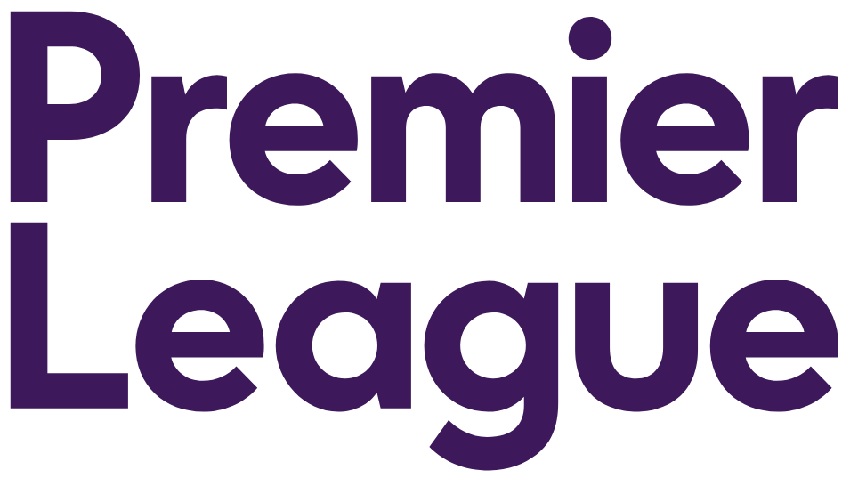

# Összefoglaló a projektről

Ez egy bemutató, gyakorló projekt a 2023/2024-es Premier League évadáról. Egyfajta információs adatbázis az induló csapatokról.

Ehhez a szerveroldalon a **Node.js** JavaScript futtatókörnyezetet, míg a kliensoldalon a **React.js** JavaScript könyvtárat fogjuk használni.
Az adatbázis támogatást a **MongoDb** adatbázis szoftverrel fogjuk megoldani.
